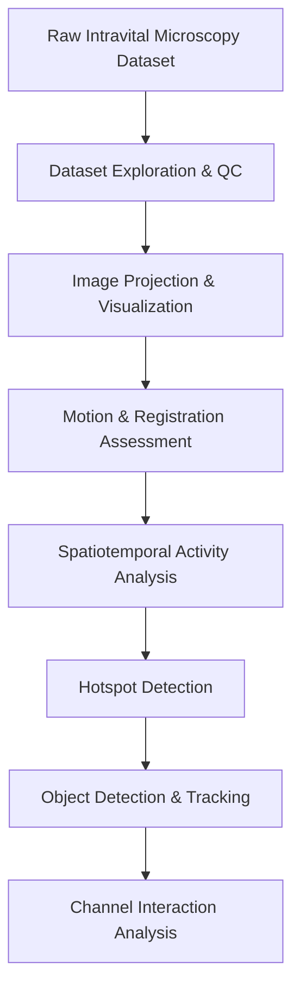
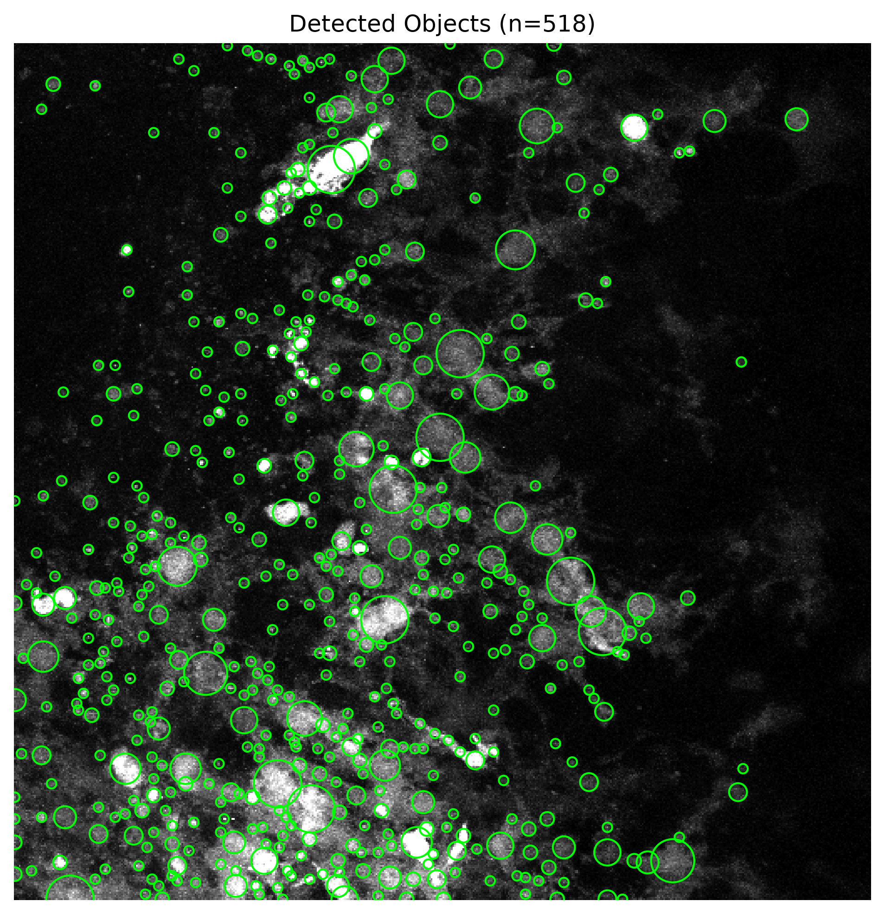
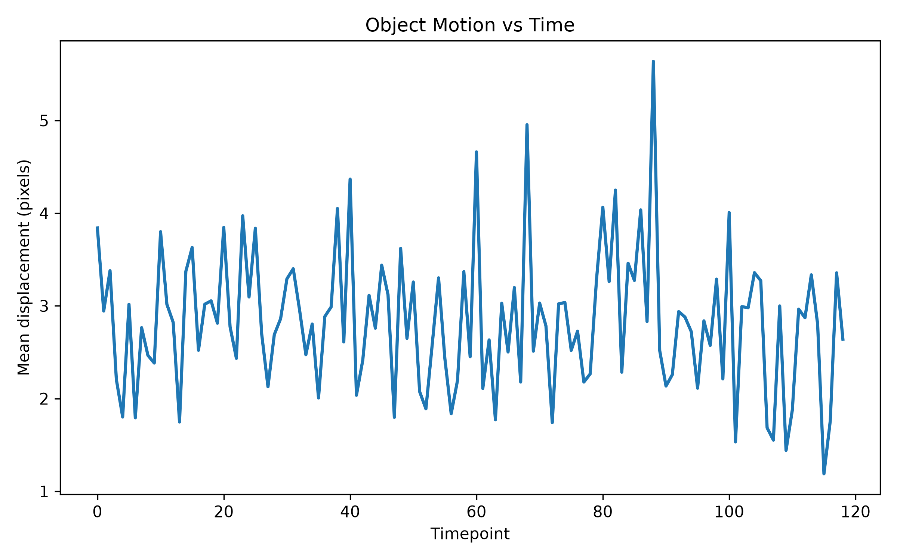

# Quantitative Time-Lapse Microscopy

A python workflow for exploration, quality control, motion correction, activity mapping and object tracking in multi-channel time-lapse microscopy datasets.

## Data Source

This project uses a publicly available intravital microscopy dataset stored in Imaris/HDF5 format: **[An in vivo microscopy dataset capturing leukocyte cell death](https://zenodo.org/records/14551288)**.

The dataset consists of:

* 120 time points
* 3 fluorescence channels
* 24 z-slices per time point
* 512 × 512 pixel spatial resolution
* 16-bit image depth (`uint16`)

The HDF5 hierarchy was programmatically explored to reconstruct the full volumetric time series and extract channel-specific image stacks. The dataset organization was determined directly from the file structure during analysis, including temporal, spatial, and channel dimensions.




## Installation
Install [anaconda](https://www.anaconda.com/) or [miniconda](https://www.anaconda.com/docs/getting-started/miniconda/main).

Create a conda environment:

```bash
conda create -n qtlm python=3.11
conda activate qtlm
```

Install dependencies:

```bash
pip install -r requirements.txt
```


Please save the dataset folder in `./` as `Data` folder before starting the experiments.

## Dataset exploration and volumetric image inspection.

```bash
python src/dataset_explorer.py
python src/generate_mips.py
python src/zstack_explorer.py
```

## Image quality control, drift estimation, and registration assessment.

```bash
python src/global_intensity_analysis.py
python src/motion_screen.py
python src/registration_check.py
python src/temporal_correlation.py
```

## Multi-channel visualization and timelapse rendering.

```bash
python src/create_overlay.py
python src/make_timelapse_movies.py
python src/motion_corrected_movie.py
```

## Spatiotemporal activity mapping and hotspot detection.

```bash
python src/activity_map.py
python src/z_activity_profile.py
python src/detect_dynamic_hotspots.py
```

## Object detection, tracking, and motion quantification.

```bash
python src/object_detection_prototype.py
python src/track_objects.py
python src/plot_object_counts.py
python src/track_object_motion.py
python src/plot_tracks.py
```

## Cross-channel interaction and correlation analysis.

```bash
python src/channel_interaction_analysis.py
```

---

## Results

### Representative Channels


Representative fluorescence channels extracted from the microscopy dataset, providing an overview of signal distribution and image quality across the experiment.

---

### Maximum Intensity Projection — Initial Frame


Maximum Intensity Projection (MIP) generated from the first time point (`t000`), highlighting the initial spatial distribution of fluorescent structures.

---

### Maximum Intensity Projection — Mid Experiment


MIP image from the midpoint of the acquisition (`t060`), enabling visual assessment of temporal changes in signal patterns.

---

### Maximum Intensity Projection — Final Frame


MIP image from the final time point (`t119`), showing the cumulative fluorescence distribution at the end of the experiment.

---

### Channel Intensity Dynamics


Temporal evolution of fluorescence intensity in Channel 2, revealing trends and fluctuations in signal activity throughout the recording.

---

### Estimated Stage Drift


Estimated sample drift over time, used to quantify positional shifts and assess the need for motion correction.

---

### Dynamic Hotspot Detection


Regions exhibiting significant temporal intensity variation, identified as dynamic hotspots within the microscopy sequence.

---

### Object Detection Prototype



Prototype object detection results showing automatically identified structures of interest within the microscopy images.

---

### Object Counts Over Time


Quantitative analysis of detected object counts across time points, providing insight into temporal population dynamics.

---

### Object Motion Vectors


Vector-based visualization of object displacement, illustrating the direction and magnitude of detected movements.

---

### Object Motion Analysis



Temporal characterization of object movement, summarizing changes in motion activity throughout the experiment.

---

### Motion Correction Comparison


Before-and-after comparison demonstrating the effectiveness of motion correction in compensating for sample drift and improving image stability.

