## Results

### Volumetric Dataset Reconstruction

Reconstruction of HDF5 dataset as a four-dimensional microscopy time series (120 time points, 3 imaging channels, and 24 z-planes per frame). Maximum intensity projections made possible the rapid visualization of tissue organization and channel-specific structures across the full experiment.

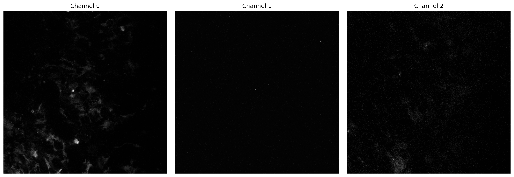 

Figure 1: representative_channels.png + MIPs

### Distinct Temporal Behavior Across Imaging Channels

Global intensity shows channel-dependent temporal dynamics. While some channels exhibited progressive intensity loss over time, others showed sustained or increasing signal levels, suggestive of distinct biological or imaging behaviors across the acquisition period.

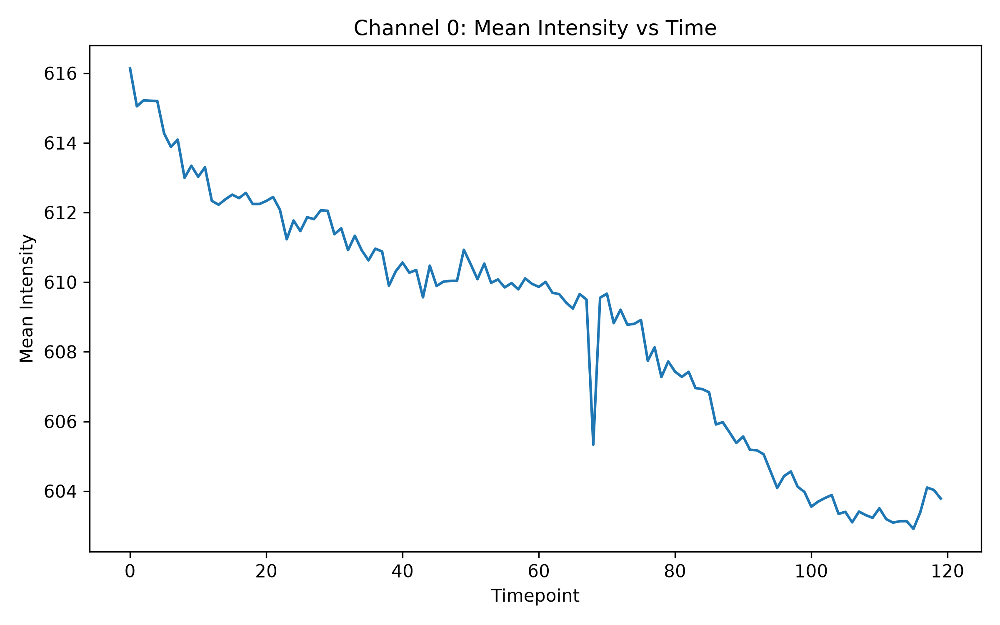 

Figure 2: channel_0_intensity_vs_time.png

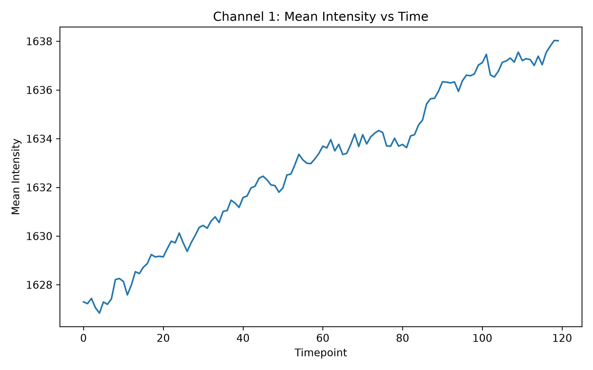 

Figure 3: channel_1_intensity_vs_time.png

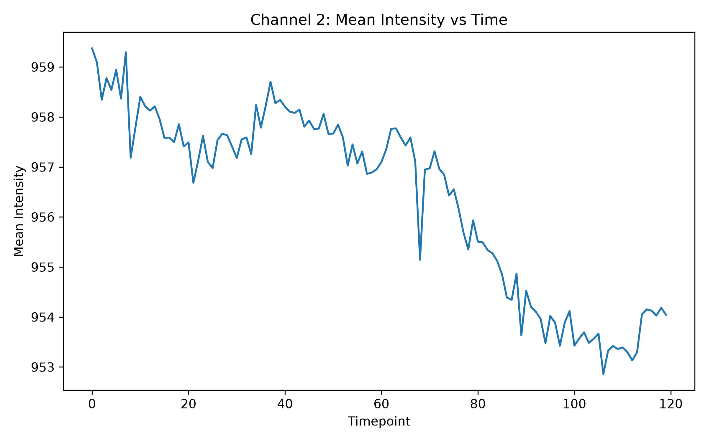 

Figure 4: channel_2_intensity_vs_time.png

### Progressive Structural Remodeling During the Time Lapse

Temporal correlation analysis shows a gradual loss of similarity between later frames and the initial reference state. Structural similarity decreased continuously throughout the movie, possibly indicating substantial biological remodeling rather than simple acquisition noise.

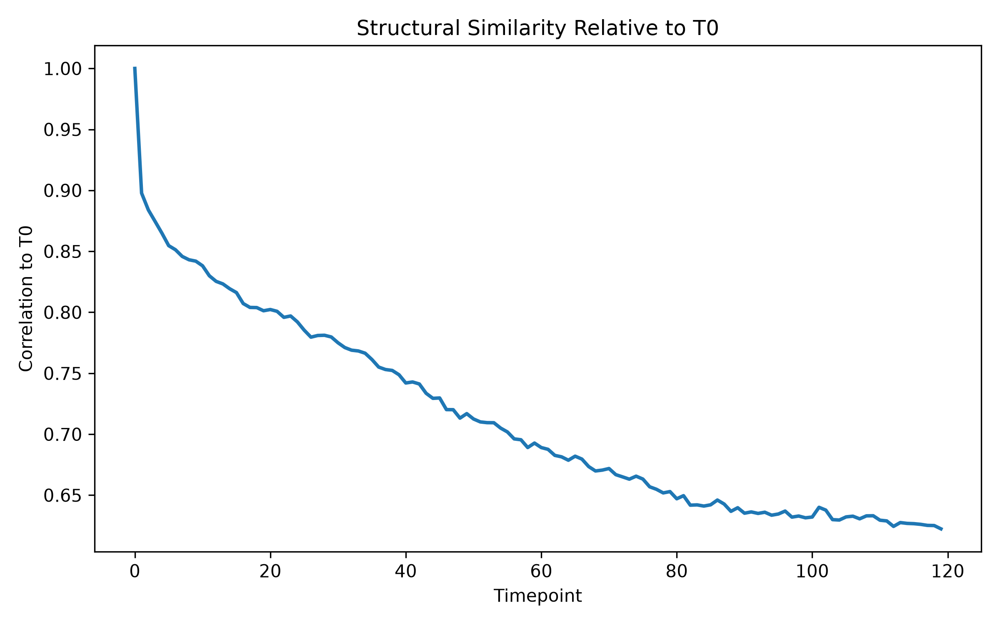 

Figure 5: temporal_correlation.png

### Dynamic Activity is Spatially Heterogeneous

Activity mapping identified localized regions with elevated temporal variation. Rather than being uniformly distributed throughout the tissue volume, activity was concentrated within discrete spatial domains, suggesting the presence of biologically active hotspots.

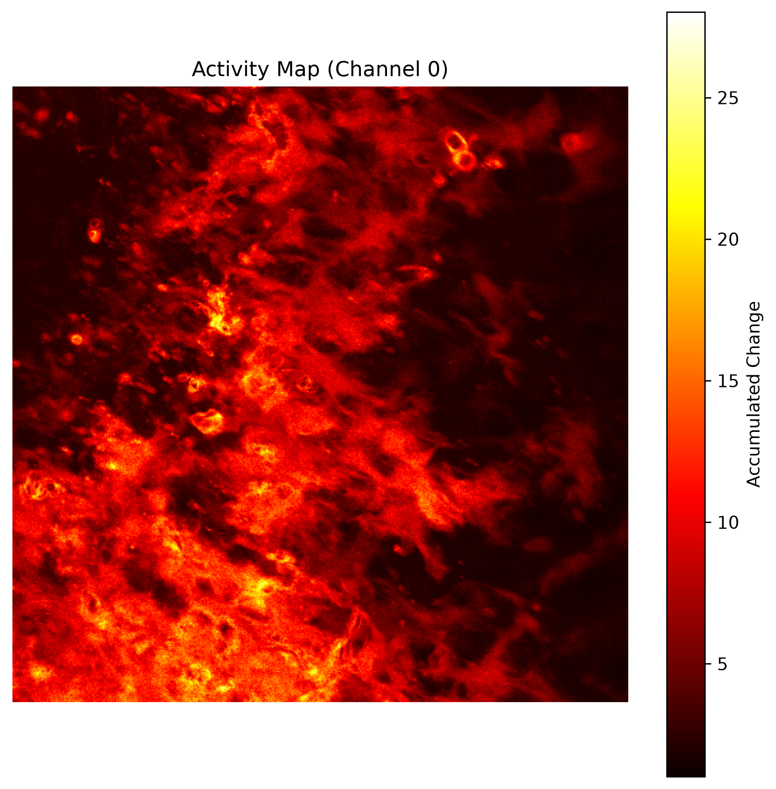

Figure 6: activity_map.png

### Dynamic Hotspots Reveal Regions of Sustained Activity

Hotspot detection- highlighted areas exhibiting persistent temporal changes across the experiment. These regions represented a small subset of the imaging field yet accounted for a disproportionately large fraction of observed activity.

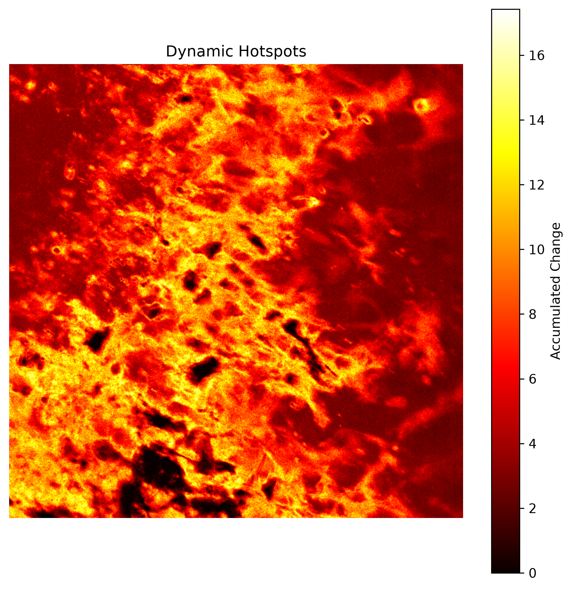

Figure 7: dynamic_hotspots.png

### Significant Temporal Dynamics Complicate Rigid Registration

Registration assessment estimated cumulative image shifts over time. However, comparison with temporal correlation measurements suggested that a substantial portion of the apparent displacement originated from biological remodeling rather than microscope stage drift.

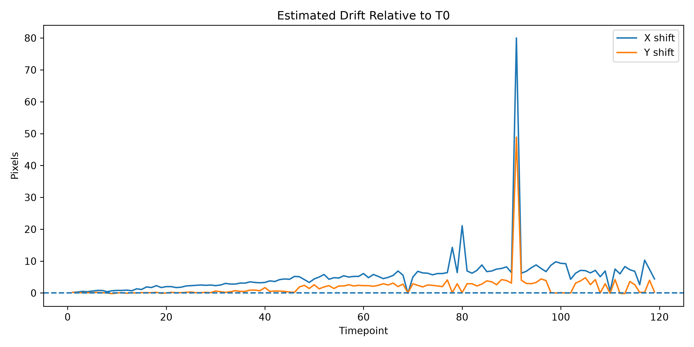

 

Figure 8: estimated_drift.png and motion_correction_drift.png

### Activity is Concentrated Within Specific Z-Planes

Z-plane activity profiling-signal dynamics were not evenly distributed throughout the imaging volume. Instead, activity was concentrated within a subset of intermediate z-slices.

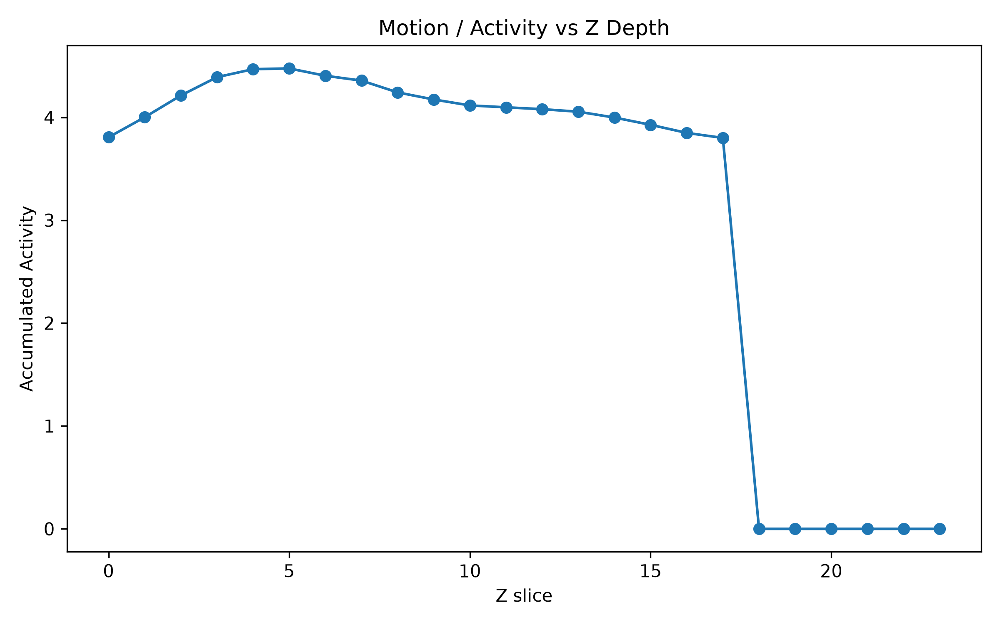 

Figure 9: z_activity_profile.png

### Object-Level Analysis Reveals Persistent Dynamic Populations

Automated object detection and tracking -- many bright structures across the time series. Object counts remained relatively stable despite ongoing temporal remodeling. Trajectory analysis- diverse patterns of motion and displacement.

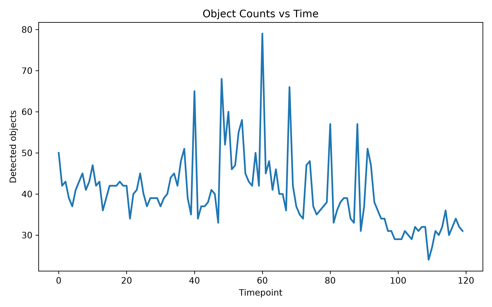 

Figure 10: object_counts_vs_time.png

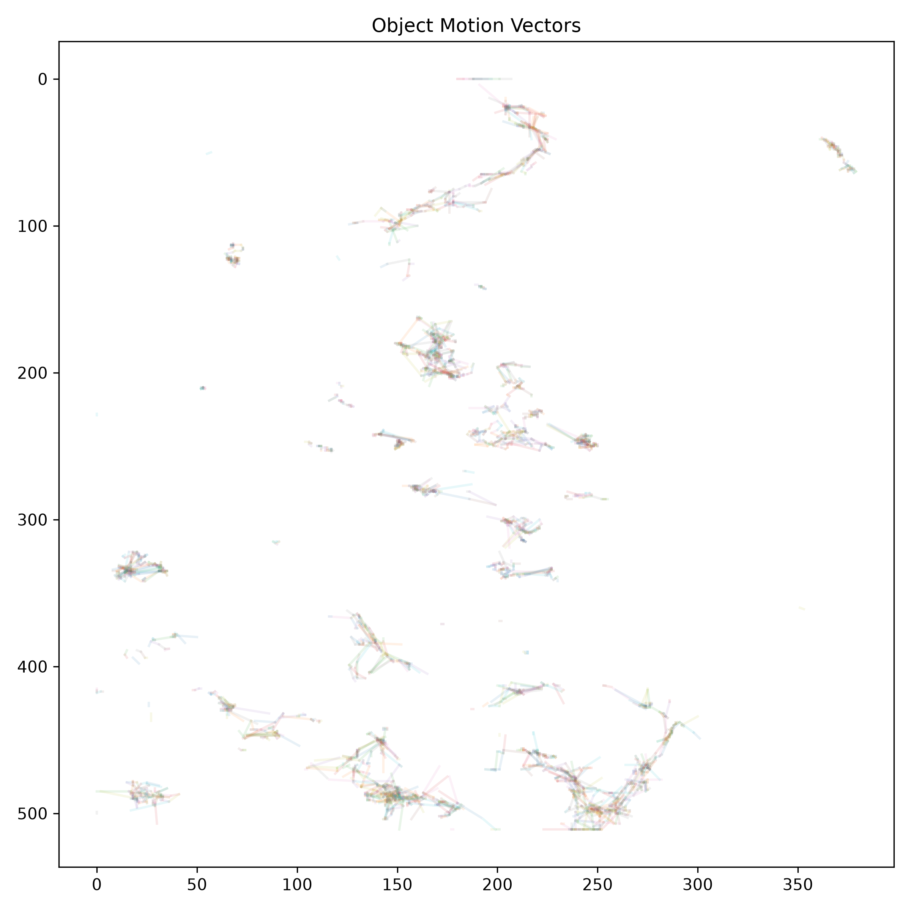 

Figure 11: object_motion_vectors.png
